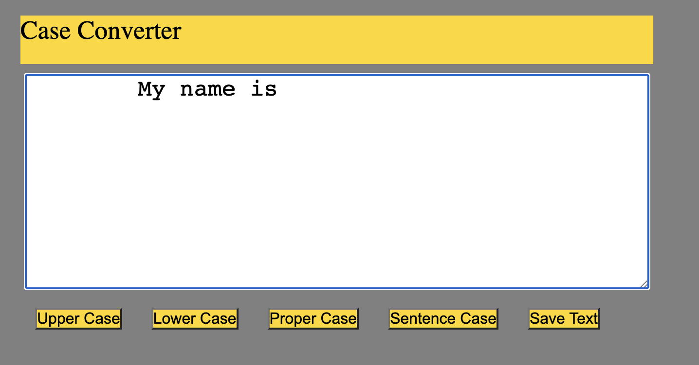

# Case-Converter
DEMO  https://godoxyfair.github.io/Case-Converter/

Приложкние написано на чистом JS.
Суть проекта в изменении регистра текста, введенного в поле.

Так же текст можно скачать.

Работа с UpperCase() LowerCase(), строками, .map и  DOM Tree JS

